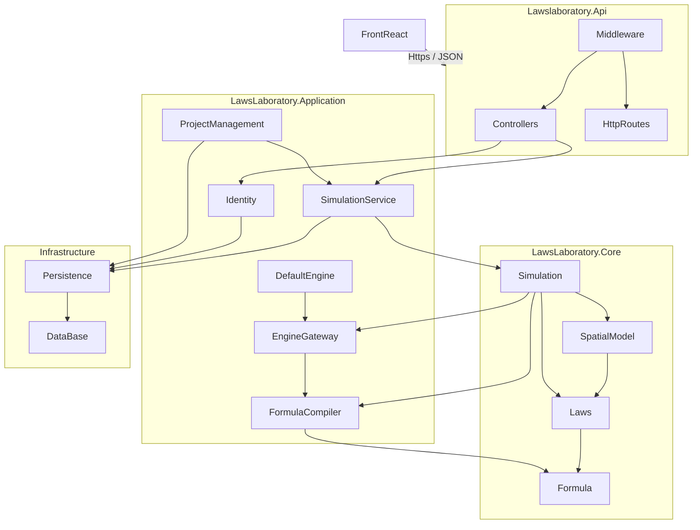
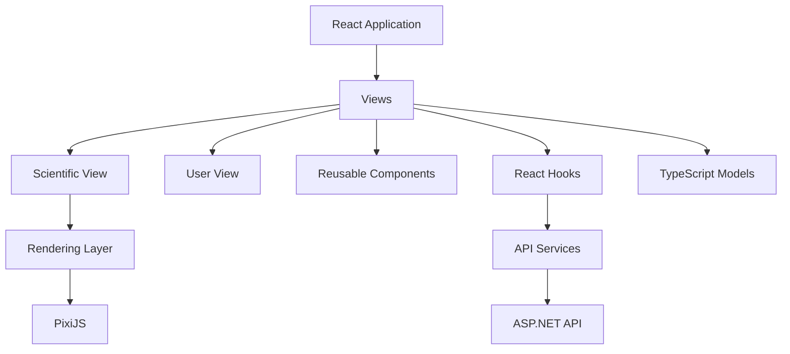

# Laws Laboratory Architecture

## 1. Overview

Laws Laboratory is organized around a layered architecture inspired by Clean Architecture principles.

The main objective is to separate:

- the scientific domain model;
- application services;
- technical infrastructure;
- user interface.

The scientific core is independent from any specific technology.  
Calculation engines, persistence systems, and graphical interfaces are external concerns that can evolve independently.

The project is divided into two main applications:

- Backend
- Frontend

---

# 2. Global Structure

```text
LawsLaboratory/

├── backend/
│
└── frontend/
```

## Backend

The backend contains:

- the scientific domain model;
- the simulation engine orchestration;
- the formula compiler;
- the communication layer with calculation engines;
- persistence mechanisms.

Main technologies:

- C#
- ASP.NET Core
- PostgreSQL (optional)

---

## Frontend

The frontend contains:

- user interaction;
- simulation configuration;
- scientific visualization;
- graphical rendering.

Main technologies:

- React
- TypeScript
- PixiJS
- Vite

---

# 3. Backend Architecture

The backend is divided into several .NET projects:

```text
LawsLaboratory.Api

        |
        ▼

LawsLaboratory.Application

        |
        ▼

LawsLaboratory.Core


LawsLaboratory.Infrastructure
```

---

# 4. Backend Package Dependencies



---

# 5. Backend Packages Description

## LawsLaboratory.Api

Responsibility:

HTTP presentation layer.

Contains:

- REST controllers;
- API routes;
- middleware;
- server configuration.

This layer translates HTTP requests into application use cases.

It does not contain scientific logic.

---

## LawsLaboratory.Application

Responsibility:

Application orchestration.

Contains the main use cases of the software.

### Simulation Service

Responsible for:

- starting simulations;
- controlling simulation execution;
- coordinating computation phases;
- applying calculation results.

---

### Formula Compiler

Responsible for:

- parsing user expressions;
- validating expressions;
- building expression trees;
- producing compiled representations.

---

### Engine Gateway

Responsible for:

- defining the communication contract with calculation engines;
- sending compiled expressions;
- receiving numerical results.

External engines are not part of the project.

They only need to comply with the defined communication protocol.

---

### Identity
Responsible for:
- managing user accounts;
- managing and administering user session;
- defining roles and permissions;


### ProjectManagement
Responsible for:
- administering workspace;
- managing simulation references.

---

# LawsLaboratory.Core

Responsibility:

Scientific domain layer.

This layer does not depend on:

- API;
- database;
- rendering engine;
- specific calculation engine.

It contains the fundamental simulation concepts.

---

## Simulation

Responsible for simulation evolution.

It:

- maintains simulation state;
- orchestrates execution steps;
- updates spatial data.

The simulation coordinates calculations but does not directly perform mathematical computations.

---

## Spatial Model

Represents the simulation space.

Contains:

- cells;
- coordinates;
- grid structure;
- neighborhood information.

Cells are passive objects.

They only store:

- their position;
- their parameters.

They do not know:

- their neighbors;
- active laws;
- the simulator.

---

## Laws

Contains scientific concepts:

- laws;
- parameters;
- variation rules;
- transmission rules;
- initialization rules;
- metrics.

---

## Formula

Represents mathematical expressions.

Expressions are represented as expression trees.

This representation is independent from any execution engine.

---

# LawsLaboratory.Infrastructure

Responsibility:

Technical implementation details.

Contains:

- persistence;
- serialization;
- database access.

This layer does not participate in scientific computation.

---

# 6. Frontend Architecture

The frontend separates:

- user interface;
- scientific rendering;
- backend communication.

Structure:

```text
src/

├── views/
├── components/
├── rendering/
├── services/
├── models/
├── hooks/
└── css/
```

---

# 7. Frontend Dependencies



---

# 8. Scientific Rendering

The rendering system is independent from the simulation engine.

The rendering pipeline is:

```text
Simulation State

        ↓

Numerical Values

        ↓

Gradient Mapping

        ↓

PixiJS Objects

        ↓

GPU Rendering
```

PixiJS is only responsible for visualization.

It does not know:

- simulation rules;
- mathematical formulas;
- calculation engines.

---

# 9. Architectural Principles

## Scientific Domain Independence

The scientific model is independent from implementation technologies.

---

## Simulation Orchestration

The simulation coordinates processes but delegates numerical computation to dedicated engines.

---

## Engine Independence

The default engine and external engines communicate through a common protocol.

---

## Calculation / Visualization Separation

A simulation can be executed independently from its rendering method.

---

## Passive Cells

Cells only represent stored simulation data.

They do not contain execution logic.

---

## Immutable Compiled Expressions

User formulas are transformed into stable intermediate representations before execution.

---

# 10. Compilation Overview

## Backend Compilation

```text
C# Source Code

        ↓

.NET Compiler

        ↓

Assemblies (.dll)

        ↓

ASP.NET Application
```

---

## Frontend Compilation

```text
TypeScript / TSX / CSS

        ↓

Vite Build System

        ↓

Optimized JavaScript + CSS

        ↓

Web Browser
```

---

# 11. Future Extensions

The architecture allows future additions:

- additional calculation engines;
- FPGA-based engines;
- 3D rendering engines;
- new persistence systems;
- advanced visualization tools.

These extensions should not require modifications to the scientific domain model.